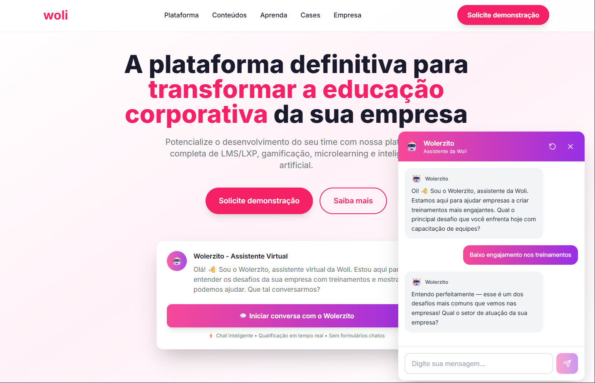
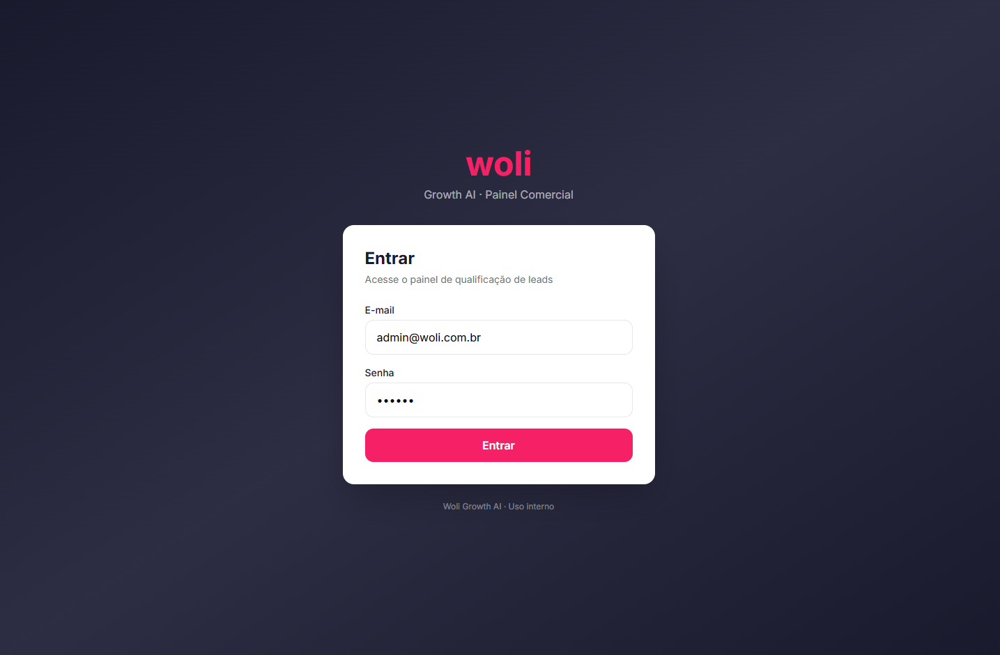
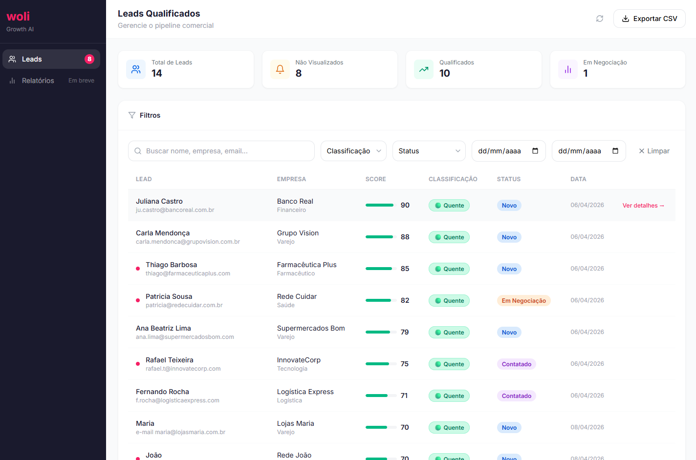
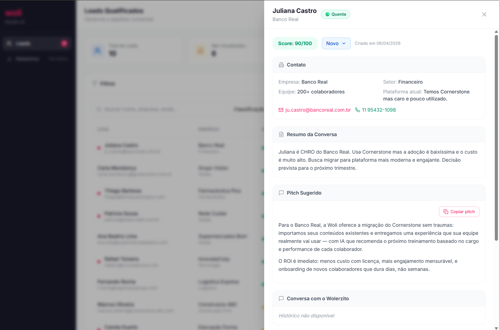

# Woli Growth AI

Sistema inteligente de qualificacao e captacao de leads para a **Woli** — plataforma de educacao corporativa. O projeto combina um chatbot conversacional com IA (o **Wolerzito**) que qualifica visitantes do site em tempo real, com um painel comercial para gestao do pipeline de vendas.

## Sobre o Projeto

O **Woli Growth AI** resolve o problema de captacao de leads de forma automatizada e inteligente. Em vez de formularios estaticos, o Wolerzito conduz conversas consultivas com visitantes, entende seus desafios com treinamento corporativo, coleta informacoes relevantes e classifica cada lead com um score de 0 a 100.

**Principais funcionalidades:**

- **Chat com IA (Wolerzito)**: Assistente virtual que conversa com visitantes, qualifica leads e gera pitches personalizados
- **Scoring automatico**: Algoritmo de pontuacao baseado em 4 dimensoes (tamanho da equipe, urgencia, fit com a Woli, maturidade digital)
- **Classificacao de leads**: Leads sao classificados como Quente, Morno ou Frio com base no score
- **Dashboard comercial**: Painel para o time de vendas visualizar, filtrar e gerenciar leads qualificados
- **Detalhes do lead**: Resumo da conversa, informacoes de contato, e pitch sugerido pela IA
- **Exportacao CSV**: Exportacao da base de leads para planilhas

## Demonstracao

### Landing Page com Wolerzito



### Tela de Login



### Dashboard de Leads



### Detalhes do Lead



## Credenciais de Acesso

Para acessar o painel comercial:

| Campo      | Valor               |
| ---------- | ------------------- |
| **E-mail** | `admin@woli.com.br` |
| **Senha**  | `123456`            |

## Tecnologias Utilizadas

### Frontend

- **React 18** — Biblioteca de UI
- **TypeScript** — Tipagem estatica
- **Vite** — Build tool e dev server
- **TailwindCSS** — Estilizacao utility-first
- **Zustand** — Gerenciamento de estado
- **React Router DOM** — Roteamento SPA
- **Lucide React** — Icones

### Backend

- **Node.js** — Runtime JavaScript
- **Express** — Framework HTTP
- **TypeScript** — Tipagem estatica
- **Prisma ORM** — Acesso ao banco de dados
- **SQLite** — Banco de dados (desenvolvimento)
- **JWT** — Autenticacao via tokens
- **bcryptjs** — Hash de senhas

### Infraestrutura

- **npm Workspaces** — Monorepo
- **esbuild** — Bundler do backend
- **Concurrently** — Execucao paralela de processos

## Estrutura do Projeto

```
woli-growth-ai/
├── apps/
│   ├── web/                 # Frontend React
│   │   └── src/
│   │       ├── components/  # Componentes (home, wolerzito, dashboard, ui)
│   │       ├── pages/       # Paginas (Home, Login, Dashboard)
│   │       ├── stores/      # Zustand stores (chat, auth)
│   │       └── styles/      # Estilos globais
│   └── api/                 # Backend Express
│       ├── prisma/          # Schema e migrations
│       └── src/
│           ├── controllers/ # Controllers das rotas
│           ├── routes/      # Rotas (chat, auth, leads)
│           ├── services/    # Logica de negocio (IA, sessoes)
│           ├── prompts/     # System prompt do Wolerzito
│           └── utils/       # Helpers (scoring, prisma)
├── packages/
│   └── shared/              # Tipos TypeScript compartilhados
├── docs/
│   └── screenshots/         # Prints de demonstracao
└── package.json             # Configuracao do monorepo
```

## Pre-requisitos

- **Node.js** 18+
- **npm** 9+

## Instrucoes de Execucao

### 1. Instalar dependencias

```bash
cd woli-growth-ai
npm install
```

### 2. Configurar variaveis de ambiente

Copie o `.env.example` para `.env` na raiz e configure:

```env
PORT=3333
DATABASE_URL=https://woli-growth-ia.onrender.com
JWT_SECRET=sua_secret_jwt
WOLI_AI_API_URL=https://api-ia.woli.com.br
WOLI_AI_TOKEN=seu_token        # Opcional — sem token, usa modo simulado
FRONTEND_URL=http://localhost:5173
NODE_ENV=development
```

### 3. Configurar o banco de dados

```bash
cd apps/api
npm run db:generate    # Gera o Prisma Client
npm run db:migrate     # Aplica migrations
npm run db:seed        # Popula dados iniciais
cd ../..
```

### 4. Rodar o projeto

```bash
# Frontend + Backend simultaneamente
npm run dev
```

Acesse:

- **Frontend**: http://localhost:5173
- **Backend**: http://localhost:3333
- **Health Check**: http://localhost:3333/health

#### Rodar separadamente

```bash
# Terminal 1 — Backend
npm run dev:api

# Terminal 2 — Frontend
npm run dev:web
```

### 5. Build para producao

```bash
npm run build
```

### Comandos uteis

| Comando              | Descricao                           |
| -------------------- | ----------------------------------- |
| `npm run dev`        | Inicia frontend + backend           |
| `npm run dev:web`    | Inicia apenas o frontend            |
| `npm run dev:api`    | Inicia apenas o backend             |
| `npm run build`      | Build de producao                   |
| `npm run db:studio`  | Abre o Prisma Studio (GUI do banco) |
| `npm run db:migrate` | Aplica migrations pendentes         |
| `npm run db:seed`    | Popula banco com dados de teste     |

## API Endpoints

| Metodo | Rota                    | Descricao                              |
| ------ | ----------------------- | -------------------------------------- |
| `POST` | `/api/chat/start`       | Inicia sessao de chat e cria lead      |
| `POST` | `/api/chat/message`     | Envia mensagem e recebe resposta da IA |
| `POST` | `/api/chat/end`         | Finaliza chat e calcula score          |
| `GET`  | `/api/chat/session/:id` | Consulta status da sessao              |
| `POST` | `/api/auth/login`       | Autenticacao do painel                 |
| `GET`  | `/api/leads`            | Lista leads qualificados               |
| `GET`  | `/api/leads/:id`        | Detalhes de um lead                    |
| `GET`  | `/health`               | Health check do servidor               |

## Deploy

O projeto possui configuracoes prontas para:

- **Backend**: [Render](https://render.com) (`render.yaml`) ou [Railway](https://railway.app) (`railway.toml`)
- **Frontend**: [Vercel](https://vercel.com) (`vercel.json`)
